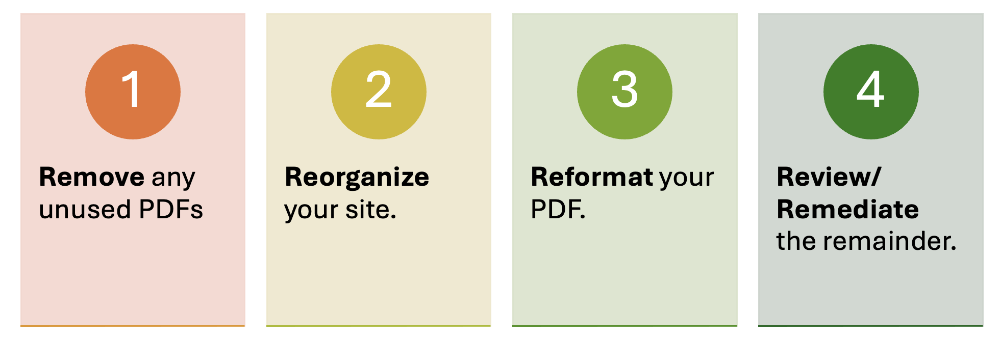
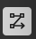

# PDF Funnel

We recommend you following the four steps outlined below to maximize your efforts managing your documents.

## 1. Remove any unused PDFs

Find the full training in our Digital Accessibility Network on [how to Manage your Documents]() 

To find and review all of your PDFs inside of your website 
The following is for members of the Rutgers community, that have access to Deque University. This is the preferred method finding all of your documents:
1.	Log into Deque Axe Monitor 
2.	Click on Issues on the top ribbon

If you have not run a scan of your site previously, you will need to hit scan on the top ribbon and start scan first. You can find full instructions on how to do so on our wiki: Using Deque Axe Monitor. Once you've finished scanning your site you can proceed to the next step.

3.	Make sure the Organization and Project matches the Organization and Project you are looking to review the PDFs for  
4.	In the first field, URL Contains, type .pdf . This will search your site for pdf files. You can change this to any document type extension. To find all your PDFs ensure the severity is set to All Issues (to include even those that pass)
5.	Click Search
6.	In the results area, click the drop down and then Select All.
7.	Under Actions, click Export (Brief) and then Apply. 
A CSV file will export to your computer. Open this file.
8.	Once you open the CSV file in excel, copy column- URL and paste it into a new sheet. You can click the plus icon on the bottom of the workbook to create a new sheet.
 
9.	Select all of the items in Column A, then go to Data in your top ribbon and click on the icon for remove duplicates
 
This will narrow your list to just unique PDFS.

## 2. Reorganize your site
See full training on the Laws and Regulations you need to know.
Archived Content- Web
The updated DOJ Title II regulations allow archived content as an exception to its WCAG requirements. You must meet all 4 conditions for this exception: 
1.	The content was created before the date the state or local government must comply with this rule, or reproduces paper documents or the contents of other physical media (audiotapes, film negatives, and CD-ROMs for example) that were created before the government must comply with this rule, AND 
2.	The content is kept only for reference, research, or recordkeeping, AND 
3.	The content is kept in a special area for archived content, AND 
4.	The content has not been changed since it was archived. 
 
Examples: 
* *Exempt*- University Finance Administration, has budget sheets available on their site from 3 years ago, and that is stored in an “archive” section of its website and has not updated would probably fall under the exception. 
* *Not Exempt*- It is December 2026, and the University Senate has meeting minutes created after the April 26, 2026 and is in the Archived section of their site. This does NOT apply to the exception.

## 3. Reformat your PDFs
For any content that was originally a Word or Powerpoint file, we recommend you use the original source file. If needed, these can be made into Read-Only files. If you only have the PDF version, you can use the following tools to reformat them:

* [Adobe Acrobat](https://software.rutgers.edu/product/3735)
* [Sensus Access](https://it.rutgers.edu/digital-accessibility/knowledgebase/sensusaccess/)

For any content that it a PDF form, you should consider converting into a webform using the following:

* [Qualtrics ](https://it.rutgers.edu/qualtrics/)
* [Microsoft Forms](https://it.rutgers.edu/microsoft-office/microsoft-office-for-students/)

For all other documents that should be truly a PDF you should continue below.

### What to know before reformatting your document
There are many directions a document can take.  We recommend that your final document remain as Word or PowerPoint files, as these tend to be more inherently accessible than PDFs. 

### Converting from a PDF:
You can convert from a PDF back into the following formats using Adobe Acrobat and Sensus Access:
* Microsoft Word/ PPT /Excel
* Accessible PDF (PDF UA)
* HTML

You can either use Adobe's save as function or Sensus access to convert your document from PDF to a MS format or a tagged PDF. 
Common Issues
Below are some issues we found as we were doing this demo and how to fix it
* [Set document Language (word)](http://support.microsoft.com/en-us/office/add-an-editing-or-authoring-language-or-set-language-preferences-in-office-663d9d94-ca99-4a0d-973e-7c4a6b8a827d)
* [Add Alt text to images (word)](https://support.microsoft.com/en-us/office/add-alternative-text-to-a-shape-picture-chart-smartart-graphic-or-other-object-44989b2a-903c-4d9a-b742-6a75b451c669)
* [Review references (footnotes/end notes) (word)](https://support.microsoft.com/en-us/office/add-alternative-text-to-a-shape-picture-chart-smartart-graphic-or-other-object-44989b2a-903c-4d9a-b742-6a75b451c669)
* [Check Reading order (Adobe)](https://helpx.adobe.com/acrobat/using/touch-reading-order-tool-pdfs.html)

### Converting to a PDF
When converting to a PDF, important that you are:
1.	Starting with an accessible document. If you are using Microsoft we recommend that you utilize the Accessibility Checker as a base-line for accessibility
2.	When you convert to a PDF, we recommend you use the ‘Save As’ function. When you print to a PDF, especially if you are using a plug-in like cute PDF, etc it will flatten the document to one image.
3.	Ensure that your setting are correct when you save your document. For Windows, click Options > check- Document Properties & Document structure for accessibility. On a mac select: Best for electronic distribution and accessibility
4.	Check the PDF output. In Adobe Acrobat go to All tools > Prepare for Accessibility > Check for Accessibility 

You can also use Sensus Access, to upload the document. Select Accessible Conversion > PDF

### Common issues converting to PDF
Below are some issues we found as we were doing this demo and how to fix it
* [Repeat table heading row (in word)](https://support.microsoft.com/en-us/office/repeat-table-header-on-subsequent-pages-2ff677e0-3150-464a-a283-fa52794b4b41)
* F[ixing tables that span multiple pages (in Adobe)](https://www.youtube.com/watch?v=ykP9KAAVhSg&t=1s)
* [Adding alt text to images (in Adobe)](https://elearning.adobe.com/2024/02/how-to-add-alt-text-in-adobe-acrobat-a-step-by-step-guide/)
* [Adding a title to document (in Adobe)](https://helpx.adobe.com/acrobat/using/pdf-properties-metadata.html)
* [Color Contrast Checker ](https://webaim.org/resources/contrastchecker/)

## 4. Review/Remediate your PDF
We recommend using Adobe Acrobat to remediate your PDF.

### Run check for accessibility
In adobe find the Prepare for accessibility icon > Check for accessibility

In the open dialogue box, click Start Checking

This will bring up a list of items to be checked for accessibility. We will proceed with the following items should they appear on your report.

Adobe Verify Accessibility Issues page will give you an overview of all of the issues that you might run into and how to fix them.

### Scan and OCR your document
To fix this rule check manually, use OCR to recognize text in scanned images:
1.	From the All tools menu, select Scan & OCR.
2.	From the Scan & OCR panel, under Recognize Text, select In this file.
3.	From the Pages dialog, select the pages you want to process, the document language, and then select Recognize text.

### Auto Tag PDF
1.	Select All tools > Prepare for accessibility > Automatically tag PDF. 

If there are any issues, the Add Tags Report appears in the navigation pane. It lists potential problems by page, provides a navigational link to each problem, and suggests ways to fix them. 

### Add Alternative text
1.	Click Add Alternative Text > OK
Adobe will highlight the image, and a pop up will appear allowing you to add an Alt-Text. If it is a decorative image you can click the check box to indicate that.

### Color Contrast
Color contrast requires manual checks. To do so we recommend using WebAim color contrast analyzer.

Once you have checked all of the elements, right click on the Color Contrast issue in the Accessibility Review, and click Fixed
 
### Check Reading order
On the right hand side, you’ll see the following icon: 
 

Click this to open the reading order. The page will now have an overlay with numbers next to each tagged item. Click Open Reading order and this will correspond to the right hand side.
  
You can click and drag the items in this list to change the order in which a screen reader will read these. 
 
### Fix Reading order 
Go to Prepare for Accessibility > Fix reading Order 
 
A toolbar will pop up and your mouse will become a cross-hair 
  
Click and drag a region to select it: 
  
And then hit the appropriate element type in the reading order module box: (in this case a Heading 1) 
  
Do this for all the elements on the page that need fixing.  

It may be necessary after this step to check the reading order again, and drag the elements in the Order list to the right reading order. 
 
Mark Passed in the accessibility report 

Once completed go back to your accessibility report by going to: 
Prepare for accessibility > Check for accessibility 

If it still indicates Logical Reading Order – Needs Manual check: 
Right Click on Logical Reading Order- Needs Manual Check > select Passed 
 
 
### Document Properties 
 It important that we giving our PDF a title in the properties menu. To do so:

File> Document Properties

From there you will see fields for Title under Description.

